# Supervisor Presentation: Weekly Progress Update

**Project:** Geochem Benchmark Extraction Pipeline  
**Period:** March 12-19, 2026  
**Audience:** Supervisor / project review meeting  
**Purpose:** Explain what changed, what was validated, and why it matters for project outcomes

---

## Slide 1. Title Slide

### On-Screen Content
- Weekly Progress Update
- Geochem Benchmark Extraction Pipeline
- March 12-19, 2026

### Speaker Script
This week’s work focused on making the extraction system substantially more accurate and more reliable on real scientific papers. The important result is not just that the pipeline runs, but that it now combines multiple extraction methods, preserves more useful data, and handles difficult documents without failing.

---

## Slide 2. Why This Work Was Necessary

### On-Screen Content
- Research papers are inconsistent and highly variable
- Supplementary files are often incomplete
- Important data is split between spreadsheet and PDF
- A single extraction path causes avoidable data loss

### Speaker Script
The core problem is that geochemical papers do not present information in a uniform way. Some key values appear in supplementary spreadsheets, while other essential details only exist in the paper PDF. In the earlier setup, if a supplementary file was present, the PDF could be effectively ignored. That created a blind spot where valid data was left behind. This week’s work was designed specifically to remove that weakness.

---

## Slide 3. Pipeline Overview

### On-Screen Content
- Stage 1: Read the paper and extract the key context
- Stage 2: Parse supplementary spreadsheets into structured sample rows
- Stage 3: Extract PDF tables using multiple methods in parallel
- Stage 4: Merge all sources and keep the best available information
- Final output: a complete benchmark-ready dataset

### Speaker Script
The pipeline is best understood as four connected stages. First, we read the paper itself and extract the high-level scientific context such as deposit type, mineral, and analytical method. Second, we parse the supplementary files, which usually contain the raw numerical measurements. Third, we analyze the PDF tables using multiple detection methods so we can recover data that supplementary files may miss. Finally, we merge everything into one final dataset, keeping the most complete and trustworthy information from each source.

This staged design is important because it separates the problem into the parts that each source is best at. The PDF provides context, the supplementary file provides numerical detail, and the merge step ensures we do not lose information when the two sources overlap or disagree.

---

## Slide 4. What the Self-Correction Layer Contributes

### On-Screen Content
- Detects when parsing has failed
- Identifies the reason for failure
- Retries using targeted corrections
- Recovers data from difficult tables

### Speaker Script
The self-correction layer is the system’s recovery mechanism for difficult tables. If a supplementary file is structured in an unusual way, the pipeline does not simply stop. It diagnoses the problem, applies a targeted fix, and tries again. This is important because a meaningful portion of papers are not straightforward enough for one rigid parsing rule to work every time. The result is better recovery from papers that would otherwise need manual intervention.

---

## Slide 5. What Changed in PDF Extraction

### On-Screen Content
- Three extraction methods now work together
- Each one handles different PDF table styles
- The system uses the best available result
- Coverage is stronger across diverse papers

### Speaker Script
We upgraded PDF extraction from a single-method approach to a three-method strategy. One method performs best on complex layouts, another on borderless tables, and another on clean bordered tables. That matters because the paper collection is heterogeneous. There is no guarantee that one method will work for every document. By combining the methods, we get much better coverage across the corpus.

---

## Slide 6. The Most Important Logic Change

### On-Screen Content
- Before: supplementary OR PDF
- Now: supplementary AND PDF
- Both sources are extracted every time they exist
- Final output keeps all unique information

### Speaker Script
The biggest architectural fix this week was changing the pipeline from an either-or model to a both-sources model. Previously, supplementary data could block PDF extraction. That meant we were assuming supplementary files were complete when they often are not. The new behavior is more complete and more defensible: extract both sources, then merge them intelligently so we keep the best available information from each.

---

## Slide 7. How We Avoided Losing Data

### On-Screen Content
- Deduplicate by sample name
- Keep curated supplementary values when both sources overlap
- Use PDF to fill missing gaps
- Retain every unique sample row

### Speaker Script
The merge logic is designed to protect the data rather than overwrite it. When the same sample appears in both sources, the supplementary value is generally preferred because it is more curated. But if supplementary is missing a value, the PDF can fill that gap. The key point is that the system does not throw away valid sample rows simply because they came from different sources.

---

## Slide 8. Reliability Improvement on Standard Hardware

### On-Screen Content
- Advanced PDF processing can be memory-intensive
- The system now retries in a lighter mode
- It falls back automatically if needed
- Extraction continues instead of crashing

### Speaker Script
We also improved reliability in the face of memory limits. On standard machines, advanced PDF processing can run into memory errors on some larger documents. The updated behavior is to retry with a lighter processing path before falling back to simpler methods. That means the system keeps working in real conditions, rather than requiring special hardware or manual intervention.

---

## Slide 9. Results in Plain Numbers

### On-Screen Content
- Overall accuracy: 59.21% to 73.74%
- Improvement: +14.53 percentage points
- Relative gain: 24.5%
- Papers evaluated: 26
- Total samples processed: 8,909

### Speaker Script
The most important measurable result is the improvement in overall accuracy. The benchmark moved from 59.21 percent to 73.74 percent, which is a 14.53 percentage point gain. In relative terms, that is a 24.5 percent improvement. This is a substantial jump in a benchmark setting, and it confirms that the new extraction strategy is genuinely better, not just different.

---

## Slide 10. Where the Improvement Came From

### On-Screen Content
- Better numerical extraction from PDF fill-in
- Better sample coverage across both sources
- Fewer false missing values
- Better handling of hard layouts

### Speaker Script
The improvement did not come from a single change. The biggest effect came from filling numerical gaps where supplementary files were incomplete. We also improved sample coverage and reduced incorrect null values. In practical terms, the system now captures more of the real data in each paper and is less likely to miss values that are actually present.

---

## Slide 11. Validation on Real Papers

### On-Screen Content
- 2016_Frenzel_etal: 1,056 samples extracted successfully
- 2019_Bauer_etal: 719 samples extracted successfully
- Docling hit memory limits in both cases
- The pipeline still completed successfully

### Speaker Script
We validated the changes on real examples from the paper collection. In one paper, the pipeline successfully extracted 1,056 samples. In another, it extracted 719 samples. In both cases, the advanced PDF method hit memory limits, but the pipeline still completed because the fallback behavior took over. That is important because it shows the system is not fragile; it is designed to continue operating even when one path struggles.

---

## Slide 12. What the Supervisor Should Take Away

### On-Screen Content
- More accurate extraction
- Less data loss
- Better robustness on difficult papers
- Ready for broader batch processing

### Speaker Script
The main takeaway is that the system is now materially better for the research problem we are trying to solve. It extracts more accurately, loses less information, and handles complex papers more reliably. This makes it much more suitable for broader batch processing and for building a dependable benchmark pipeline.

---

## Slide 13. Current Status and Next Step

### On-Screen Content
- Core objectives complete
- Major pipeline risks addressed
- Remaining enhancements are optional
- Next step: broader validation and traceability if needed

### Speaker Script
At this stage, the core work for this phase is complete. The important risks have been addressed, the results are validated, and the system is in a strong state for further evaluation. The next logical step is broader batch validation to confirm the gains across the full collection. If needed, optional provenance tracking can be added later to improve traceability, but it is not blocking progress.

---

## Slide 14. Batch Summary Comparison

### On-Screen Content
- Batch v2: 41 papers, 30,320 rows extracted
- Mean quality score: 64.43%
- Mean metadata completeness: 9.00%
- Batch v3: 41 papers, 30,665 rows extracted
- Mean quality score: 82.92%
- Mean metadata completeness: 85.93%

### Speaker Script
The two batch summary tabs are a direct before-and-after comparison. Batch v2 is the earlier baseline. It processed the same 41-paper set, but the average quality score was much lower at 64.43 percent and metadata completeness was only 9.00 percent. That tells us the earlier pipeline was extracting numerical data reasonably well, but it was leaving most of the paper-level context behind.

Batch v3 is the improved run. It still processed the same 41 papers, but the quality score rose to 82.92 percent and metadata completeness rose to 85.93 percent. That is the clearest proof that the pipeline changes did not just improve one narrow part of the workflow; they improved the full extraction output.

---

## Slide 15. What the Comparison Shows

### On-Screen Content
- The new pipeline is much stronger than the earlier batch
- Metadata capture improved dramatically
- Quality increased while row volume stayed essentially the same
- The comparison supports the current multi-source design

### Speaker Script
The comparison shows a clear operational improvement. We kept the same paper count, increased the extracted row count slightly, and raised the average quality score by 18.5 percentage points. The biggest difference is metadata completeness, which went from single digits to more than 85 percent. That is the kind of change that matters because the extracted rows are only useful if they are properly contextualized.

In practical terms, this means the pipeline is now extracting more complete records rather than only raw numbers. That is why the v3 run is the better version to build on.

---

## Closing Statement

This week’s work moved the pipeline from a single-path extraction process to a more complete and resilient multi-source system. The result is a meaningful accuracy gain, less data loss, and better behavior on difficult real-world papers. That is a strong foundation for the next phase of batch validation and scale-up.

---

## Suggested Delivery Order

1. Problem statement
2. Pipeline overview
3. Self-correction value
4. Three-backend PDF strategy
5. Supplementary plus PDF merging
6. Reliability improvements
7. Numeric results
8. Real-paper validation examples
9. Batch summary comparison
10. Business takeaway
11. Next step recommendation

---

## Mermaid Diagram: Horizontal Pipeline Overview

```mermaid
flowchart LR
	A[Paper Inputs\nPDF + Supplementary Files] --> B[Stage 1\nRead Paper Context]
	B --> C[LLM Metadata Extraction\nDeposit, mineral, method, standards]
	C --> C1[Paper-Level Fields\nContext for every row]

	A --> D[Stage 2\nParse Supplementary Files]
	D --> D1[Detect Headers\nSample IDs, element columns, units]
	D1 --> D2{Parsing successful?}
	D2 -- Yes --> E[Structured Sample Rows\nNumbers, element values, sample IDs]
	D2 -- No --> D3[Self-Correction Layer\nDiagnose failure and retry]
	D3 --> D4[Retry with targeted hints\nBetter header / transposed / unit handling]
	D4 --> E

	A --> F[Stage 3\nPDF Table Extraction]
	F --> G[Docling\nComplex layouts]
	F --> H[Camelot\nBorderless tables]
	F --> I[pdfplumber\nBordered tables]
	G --> J[PDF Sample Rows]
	H --> J
	I --> J
	G --> G1{Docling memory issue?}
	G1 -- Yes --> G2[Retry in lighter mode\nOCR/image reduction]
	G2 --> H
	G1 -- No --> J

	E --> K[Stage 4\nMerge and Validate]
	J --> K
	C1 --> K
	K --> K1{Rows overlap?}
	K1 -- Yes --> K2[Keep curated supplementary values\nUse PDF to fill missing gaps]
	K1 -- No --> K3[Keep unique rows from each source]
	K2 --> L[Final Output\nBenchmark-ready dataset]
	K3 --> L

	style A fill:#f2f2f2,stroke:#666,stroke-width:1px
	style B fill:#d8e9ff,stroke:#2b6cb0,stroke-width:1px
	style C fill:#e6f7f1,stroke:#2f855a,stroke-width:1px
	style C1 fill:#eefcf6,stroke:#2f855a,stroke-width:1px
	style D fill:#fff4d6,stroke:#b7791f,stroke-width:1px
	style D1 fill:#fff8e8,stroke:#b7791f,stroke-width:1px
	style D2 fill:#fff8e8,stroke:#b7791f,stroke-width:1px
	style D3 fill:#ffe2b8,stroke:#b7791f,stroke-width:1px
	style D4 fill:#ffe8c8,stroke:#b7791f,stroke-width:1px
	style E fill:#f4fff1,stroke:#2f855a,stroke-width:1px
	style F fill:#fde2e2,stroke:#c53030,stroke-width:1px
	style G fill:#ffe8e8,stroke:#c53030,stroke-width:1px
	style H fill:#ffe8e8,stroke:#c53030,stroke-width:1px
	style I fill:#ffe8e8,stroke:#c53030,stroke-width:1px
	style G1 fill:#ffdede,stroke:#c53030,stroke-width:1px
	style G2 fill:#ffeaea,stroke:#c53030,stroke-width:1px
	style J fill:#f4fff1,stroke:#2f855a,stroke-width:1px
	style K fill:#e9ddff,stroke:#6b46c1,stroke-width:1px
	style K1 fill:#f0e6ff,stroke:#6b46c1,stroke-width:1px
	style K2 fill:#efe2ff,stroke:#6b46c1,stroke-width:1px
	style K3 fill:#f5ecff,stroke:#6b46c1,stroke-width:1px
	style L fill:#dff6dd,stroke:#2f855a,stroke-width:2px
```

